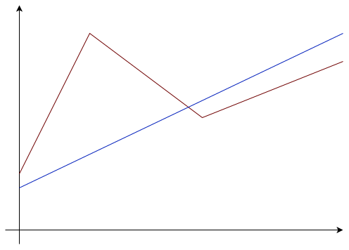
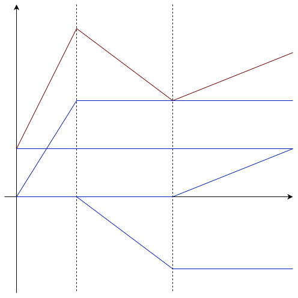
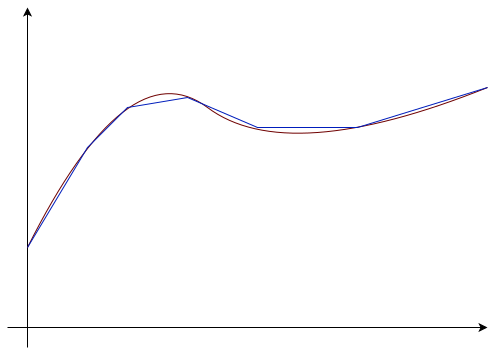
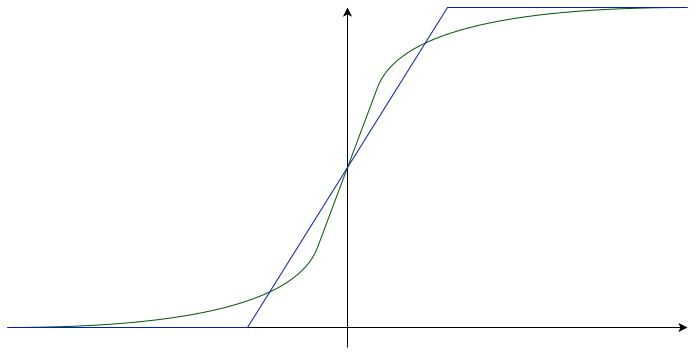
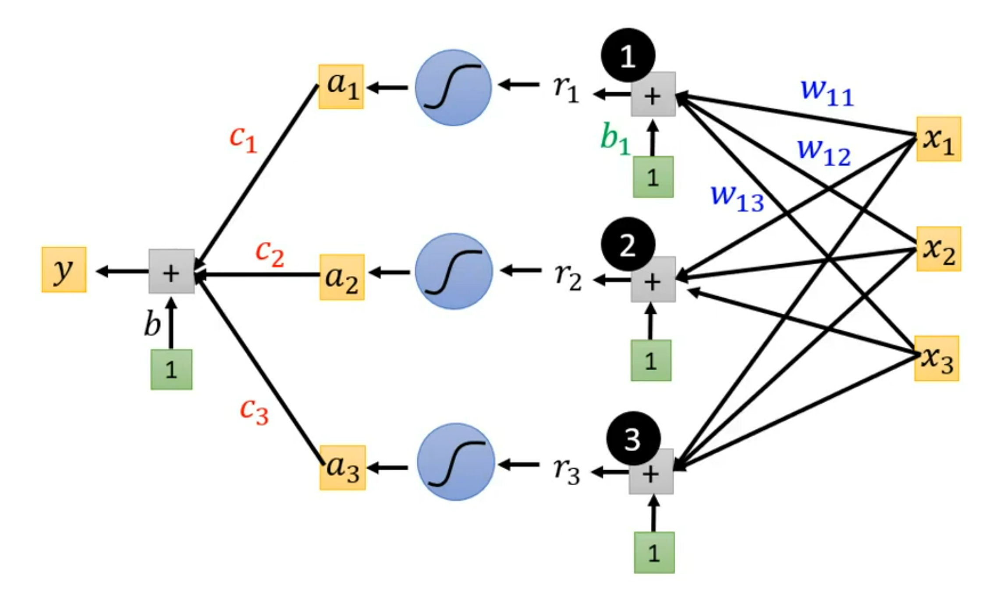
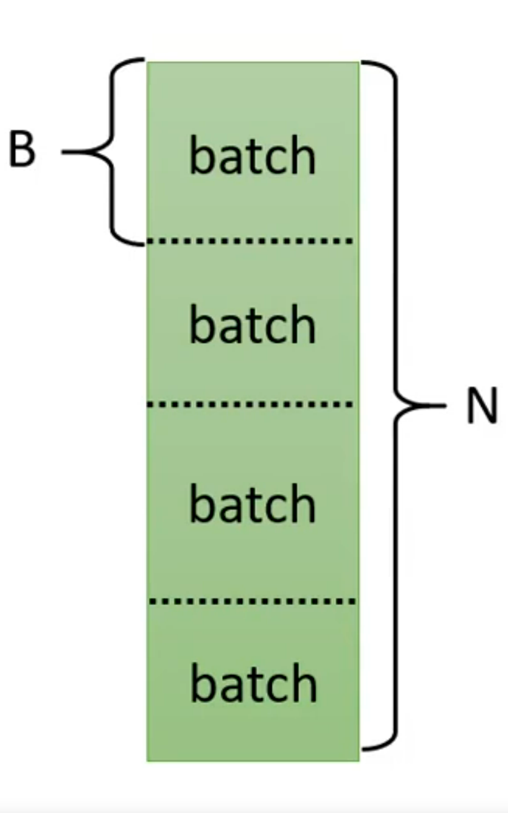
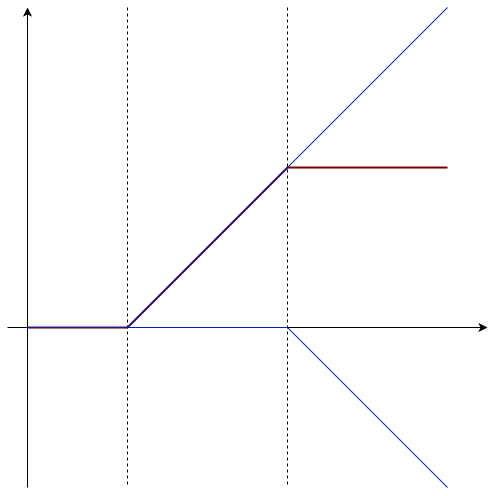
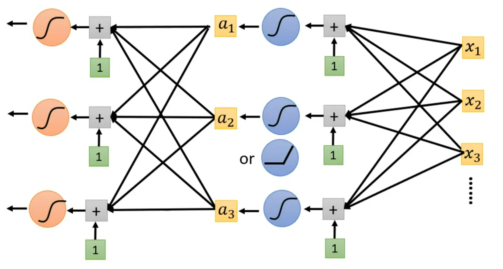

# Regression
## Linear Regression
### Linear Regression Model
 - Step1: fuction with unknown
  $$y = w\cdot x + b$$
   - `y` output, $\hat{y}$ means the label
   - `w` weight
   - `b` bias
   - `x` input or object, $x^i$ means a component of object, $x_i$ means an index of object
 - Step2: define loss
  $$L(w, b) = \sum_{n=1}^{N}(\hat{y}-y)^2$$
 - Step3: optimization

### Gradient Descent
 - Step1:(Randomly) Pick an initial value $w^0$
 - Step2: Compute $\frac{\partial L}{\partial w}|_{w = w^0}$
 - Step3: Update `w` iteratively
  $$
  w^1 = w^0 - \eta \frac{\partial L}{\partial w}|_{w = w^0} \\
  \eta: learning\ rate(hyperparameter)
  $$

Gradient descent can only find out local minima or even worse, saddle point. 

### Better Learning Rate
 - Adaptive Learning Rate
  As the parameters are updated iteratively, the  learning rate should become smaller and smaller
  $$
  \eta^t = \frac{\eta}{\sqrt{t+1}} \\
  t: number\ of\ iterations
  $$
 - Adaptive Gradient Descent(Adagrad)
  Each parameter has a different learning rate
  $$
  w^{t+1} = w^t - \frac{\eta}{\sqrt{\sum_{i=0}^t(g^i)^2}}g^t \\
  g^i = \frac{\partial L}{\partial w}|_{w = w^i}
  $$
  Consider the ratio of $g^t$ and $g^i$ rather than value of $g^t$
 - Second Derivative(mult-parameters)
 $$Step \propto \frac{|First\ derivative|}{Second\ derivative}$$
 Second derivative is hard to compute, so we use some methods to simulate the value of second derivative. For example, in Adagrad:
 $$Second\ derivative = \sqrt{\sum_{i=0}^t(g^i)^2}$$
 - Stochastic Gradient Descent(SGD)
  Randomly choose a sample and caculate the loss and then optimize it which is much faster. 

## Sigmoid Function
### "Z" Curve
Linear models have severe limitation which called **Model Bias**. For example, linear models can not represent a piecewise linear curve.

However, a piecewise linear curve can be persented by sum of a set of "Z" curves.

And a smooth curve can be represented in piecewise linear, so any curve can be represented by sum of a set of "Z" curves.

### Soomth "Z" Curve
We can use sigmoid function to represent "Z" curve in a soomth way.

$$
y = c\frac{1}{1 + e^{-(b+wx)}} = c\ sigmoid(b+wx)
$$

### Sigmoid Function Model
 - Step1: fuction with unknown
  $$
  y = b + \sum_{i}c_i\ sigmoid\left(b_i+\sum_{j}w_{ij}x_j \right) \\
  $$
  
  Or in the form of liear algorithm:
  $$
  \left\{\begin{array}{lcl}
  y = \boldsymbol{b} + \boldsymbol{c}^T\boldsymbol{a} \\
  \boldsymbol{a} = \sigma(\boldsymbol{r})\\
   \boldsymbol{r} = \boldsymbol{b} + W\boldsymbol{x} \\
  \end{array} \right.
  \Rightarrow
  y = b + \boldsymbol{c}^T\sigma(\boldsymbol{b} + W\boldsymbol{x})
  $$
 - Step2: define loss
  Parameters can be binded as a vector $\theta$.
  
 - Step3: optimization
  Vector $\theta$ has a huge number of dimensions, to optimize the vector faster, we divide samples into batches.
  
   - update: caculate on a batch
   - epoch: see all the batches once

### ReLU Function
"Z" curve can be represented by sum of two Rectified Linear Unit(ReLU)
$$
y = \begin{cases}
0 & x < x_1 \\
b + wx & x_1 \le x < x_2 \\
c & x \ge x_2
\end{cases} \\
\Leftrightarrow 
y = c\ max(0, b+wx) + c\ max(0, b'-wx)
$$

The number of ReLU Function is twice as many as of the number of Sigmoid Function.

Functions like sigmoid function and ReLU function are called activation function.

## Introduction to Deep Learning
Put the output of former layer of network as the input of next layter of network
 - Layer: A model represented before can be called a layer of network
 - Neuron: The activation function such as sigmoid function

