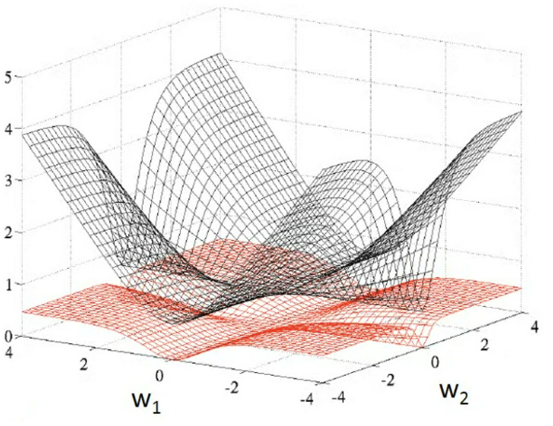
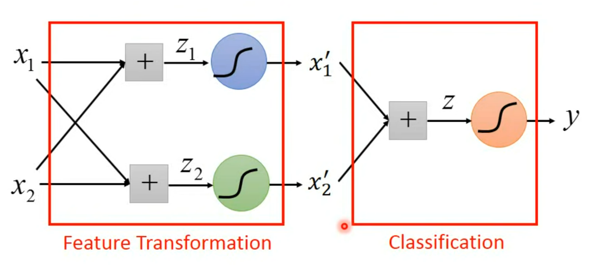

# Regression
## Linear Regression
### Linear Regression Model
 - Step1: fuction with unknown
  $$y = w\cdot x + b$$
   - `y` output, $\hat{y}$ means the label
   - `w` weight
   - `b` bias
   - `x` input or object, $x^i$ means a component of object, $x_i$ means an index of object
 - Step2: define loss
  $$L(w, b) = \sum_{n=1}^{N}(\hat{y}^n-y^n)^2$$
 - Step3: optimization
  $$w_{i} \leftarrow w_{i}-\eta \sum_{n=1}^{N}-\left(\hat{y}^n-y^n\right)x_i^n$$

### Gradient Descent
 - Step1:(Randomly) Pick an initial value $w^0$
 - Step2: Compute $\frac{\partial L}{\partial w}|_{w = w^0}$
 - Step3: Update `w` iteratively
  $$
  w^1 = w^0 - \eta \frac{\partial L}{\partial w}|_{w = w^0} \\
  \eta: learning\ rate(hyperparameter)
  $$

**Drawback**: Gradient descent can only find out local minima or even worse, saddle point. 

### Better Learning Rate
 - Adaptive Learning Rate
  As the parameters are updated iteratively, the  learning rate should become smaller and smaller
  $$
  \eta^t = \frac{\eta}{\sqrt{t+1}} \\
  t: number\ of\ iterations
  $$
 
 - Adaptive Gradient Descent(Adagrad)
  Each parameter has a different learning rate
  $$
  w^{t+1} = w^t - \frac{\eta}{\sqrt{\sum_{i=0}^t(g^i)^2}}g^t \\
  g^i = \frac{\partial L}{\partial w}|_{w = w^i}
  $$
  Consider the ratio of $g^t$ and $g^i$ rather than value of $g^t$
 - Second Derivative(mult-parameters)
 $$Step \propto \frac{|First\ derivative|}{Second\ derivative}$$
 Second derivative is hard to compute, so we use some methods to simulate the value of second derivative. For example, in Adagrad:
 $$Second\ derivative = \sqrt{\sum_{i=0}^t(g^i)^2}$$
 - Stochastic Gradient Descent(SGD)
  Randomly choose a sample and caculate the loss and then optimize it which is much faster. 

## Sigmoid Function
### "Z" Curve
Linear models have severe limitation which called **Model Bias**. For example, linear models can not represent a piecewise linear curve.

However, a piecewise linear curve can be persented by sum of a set of "Z" curves.

And a smooth curve can be represented in piecewise linear, so any curve can be represented by sum of a set of "Z" curves.

### Soomth "Z" Curve
We can use sigmoid function to represent "Z" curve in a soomth way.

$$
y = c\frac{1}{1 + e^{-(b+wx)}} = c\ sigmoid(b+wx)
$$

### Sigmoid Function Model
 - Step1: fuction with unknown
  $$
  y = b + \sum_{i}c_i\ sigmoid\left(b_i+\sum_{j}w_{ij}x_j \right) \\
  $$
  
  Or in the form of liear algorithm:
  $$
  \left\{\begin{array}{lcl}
  y = \boldsymbol{b} + \boldsymbol{c}^T\boldsymbol{a} \\
  \boldsymbol{a} = \sigma(\boldsymbol{r})\\
   \boldsymbol{r} = \boldsymbol{b} + W\boldsymbol{x} \\
  \end{array} \right.
  \Rightarrow
  y = b + \boldsymbol{c}^T\sigma(\boldsymbol{b} + W\boldsymbol{x})
  $$
 - Step2: define loss
  Parameters can be binded as a vector $\theta$.
  
 - Step3: optimization
  Vector $\theta$ has a huge number of dimensions, to optimize the vector faster, we divide samples into batches.
  
   - update: caculate on a batch
   - epoch: see all the batches once

### ReLU Function
"Z" curve can be represented by sum of two Rectified Linear Unit(ReLU)
$$
y = \begin{cases}
0 & x < x_1 \\
b + wx & x_1 \le x < x_2 \\
c & x \ge x_2
\end{cases} \\
\Leftrightarrow 
y = c\ max(0, b+wx) + c\ max(0, b'-wx)
$$

The number of ReLU Function is twice as many as of the number of Sigmoid Function.

Functions like sigmoid function and ReLU function are called activation function.

## Neural Network Model
Put the output of former layer of network as the input of next layter of network
$$
\boldsymbol{a'} = \sigma(\boldsymbol{b'} + W'\boldsymbol{\underline{a}}) \\
\boldsymbol{\underline{a}} = \sigma(\boldsymbol{b} + W\boldsymbol{x})
$$

 - Layer: A model represented before can be called a layer of network
 - Neuron: Connection between layer input and output

## Logistic Regression
### Step1: Fuction with Unknown
In Binary Classification(Lecture05), we get $P(C|x) = \frac{1}{1 + e^{-(b+\boldsymbol{w}^T \boldsymbol{x})}} = sigmoid(b+\boldsymbol{w}^T \boldsymbol{x})$. 

We can write this model as $f_{\boldsymbol{w}, b}(\boldsymbol{x}) = \sigma(\boldsymbol{w}^T\boldsymbol{x} + b)$ which is actually logistic regression. 

### Step2: Define Loss
$$
L(\boldsymbol{w}, b) = \prod_{n}f(x^n)^{\hat{y}^n}\left(1-f(x^n)\right)^{1-\hat{y}^n} \\
\ln L(w, b) = \sum_{n}\hat{y}^n\ln f(x^n) + (1-\hat{y}^n)\ln (1-f(x^n))
$$

**Cross entropy**: Suppose there is a random variable $X$, and its probability distribution is $P(X)$. When we deal with practical problems, we use an approximate distribution $Q(X)$ for fitting. At this time, the amount of information required to convey information is:
$$
H(P, Q) = -\sum_{n} P(X = x_n)\log Q(X = x_n)
$$

Also cross entropy can be written as $H(P, Q) = \mathbb{E}_{X \sim P}[-\log Q(x)]$

Then for logistic regression model, its loss can be written as a corss entropy of Bernulli Distribution.

### Step3: Optimization
$$
w^*, b^* = arg \max_{w, b}L(w, b) \\
\Leftrightarrow w^*, b^* = arg \min_{w, b}\left(-\ln{L(w, b)}\right) \\
$$

For logical regression, we can cacualte the derivative: 
$$
\begin{aligned}
\frac{\partial{\ln f_{w, b}(x^n)}}{\partial{w_i}} &= \frac{\partial{\ln \sigma(z)}}{\partial{\sigma(z)}}\frac{\partial{\sigma(z)}}{\partial{z}}\frac{\partial{z}}{\partial{w_i}} \\
& = \frac{1}{\sigma(z)} \cdot \sigma(z)(\sigma(z)-1)\cdot x_i^n \\
&= (f_{w, b}(x^n)-1)x_i^n \\
where\ z &= \boldsymbol{w}^T\boldsymbol{x} + b
\end{aligned}
$$

Then we can caculate derivative of loss function:
$$
\begin{aligned}
-\frac{\partial{\ln L(w, b)}}{\partial{w_i}} &= -\sum_{n}\hat{y}^n\ln f(x^n) + (1-\hat{y}^n)\ln (1-f(x^n)) \\
&= -\sum_{n}\hat{y}^n(f(x^n)-1)x_i^n + (1-\hat{y}^n)f(x^n)x_i^n \\
&= \sum_{n}-\left(\hat{y}^n-f(x^n)\right)x_i^n
\end{aligned}
$$

Then we should update by:
$$
w_{i} \leftarrow w_{i}-\eta \sum_{n}-\left(\hat{y}^n-f(x^n)\right)x_i^n
$$

It's as same as linear regression. 

### Why Not Square Error?
 - Step1: $f_{\boldsymbol{w}, b}(\boldsymbol{x}) = \sigma(\boldsymbol{w}^T\boldsymbol{x} + b)$
 - Step2: $L(w, b) = \sum_{n=1}^{N}(\hat{y}^n-f_{\boldsymbol{w}, b}(\boldsymbol{x^n}))^2$
 - Step3: 
  $$
  \begin{aligned}
  \frac{\partial{L}}{\partial{w_i}} &= \sum_{n=1}^{N}2(\hat{y}^n-f_{\boldsymbol{w}, b}(\boldsymbol{x^n}))\frac{\partial{f_{\boldsymbol{w}, b}(\boldsymbol{x})}}{\partial{(\boldsymbol{w}^T\boldsymbol{x} + b)}}\frac{\partial{\boldsymbol{w}^T\boldsymbol{x} + b}}{\partial{w_i}} \\
  &= \sum_{n=1}^{N}2(\hat{y}^n-f_{\boldsymbol{w}, b}(\boldsymbol{x^n}))f_{\boldsymbol{w}, b}(\boldsymbol{x^n})(1-f_{\boldsymbol{w}, b}(\boldsymbol{x^n}))x_i
  \end{aligned}
  $$

  In the figure below, red represents cross entropy and black represents square error.
  

  When output $y^n$ is far from label $\hat{y}^n$, derivative of square error is close to zero, which will slow down the learning. 

### Limitation of Logistic Regression
By logistic regress, space can only be divided using straight lines. So we may can not divide samples into correct categories. 

To solve that problem, we introduce **Feature Transformation** to pre-process input data. However, it's hard to get a certain feature transformation function so we can use another ML model to be feature transformer. 
