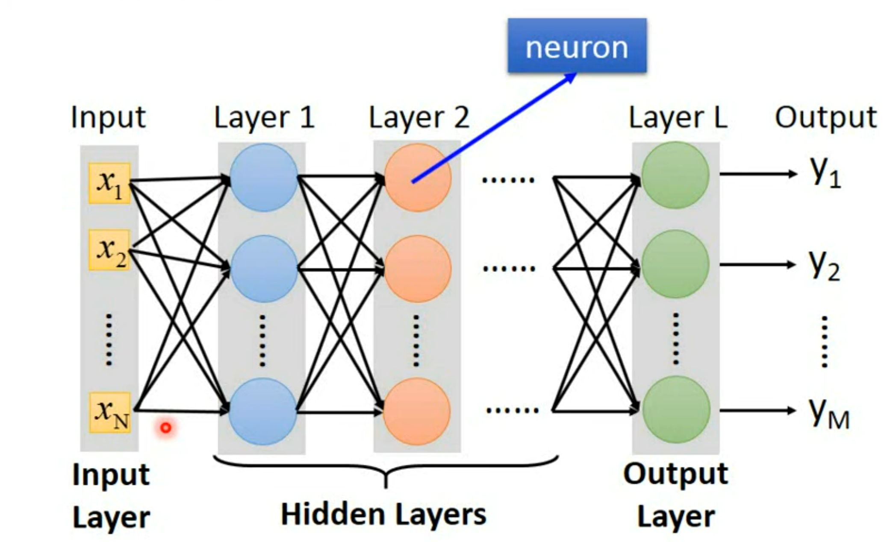
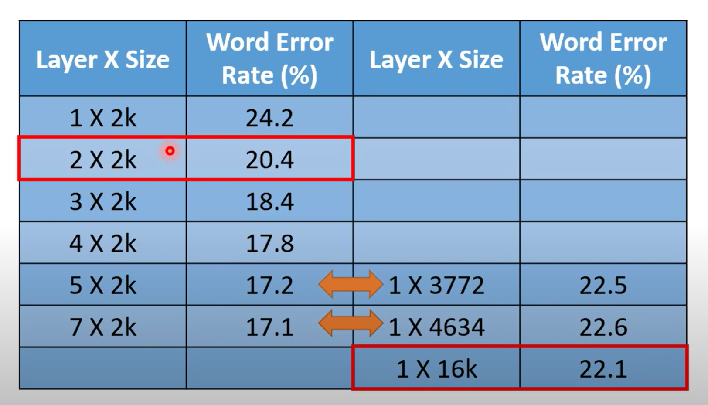
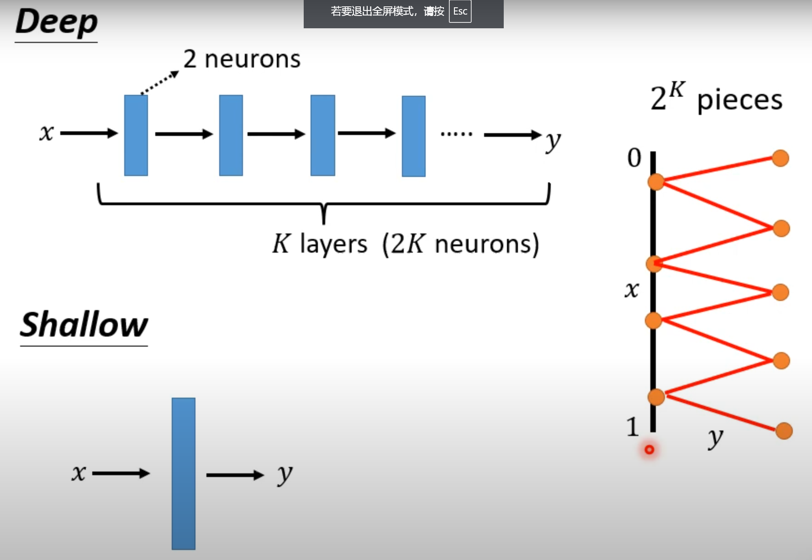
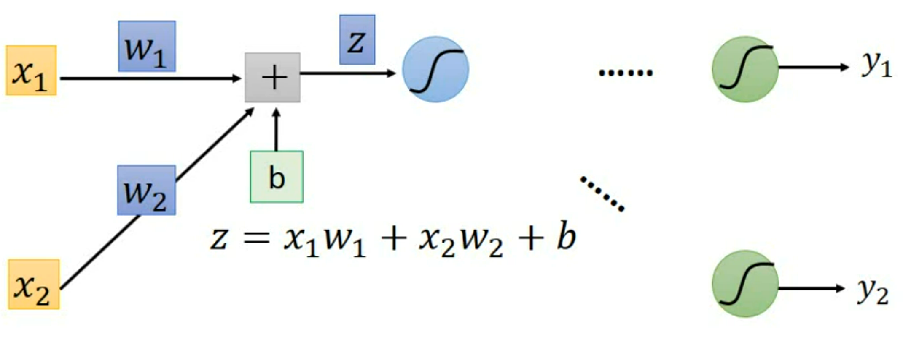
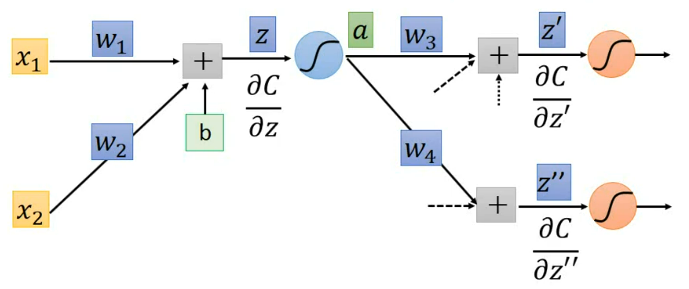
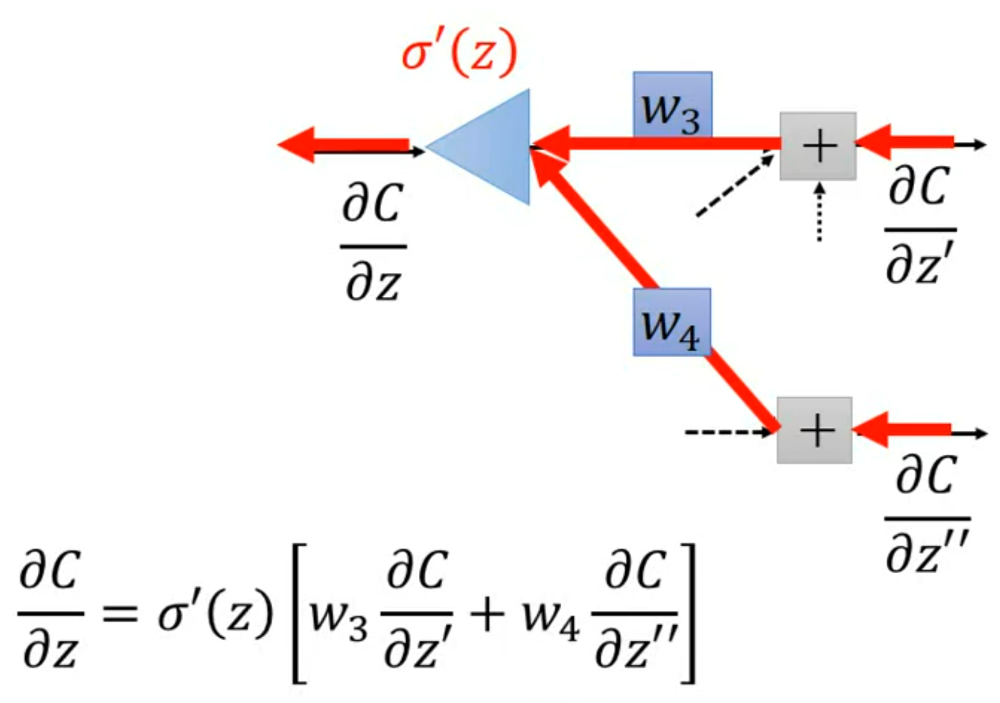
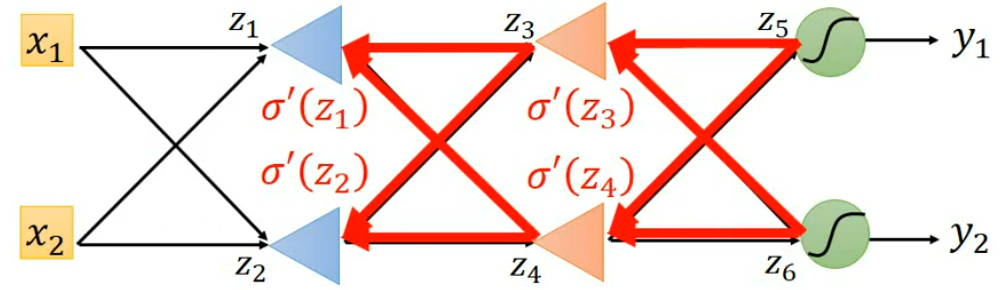
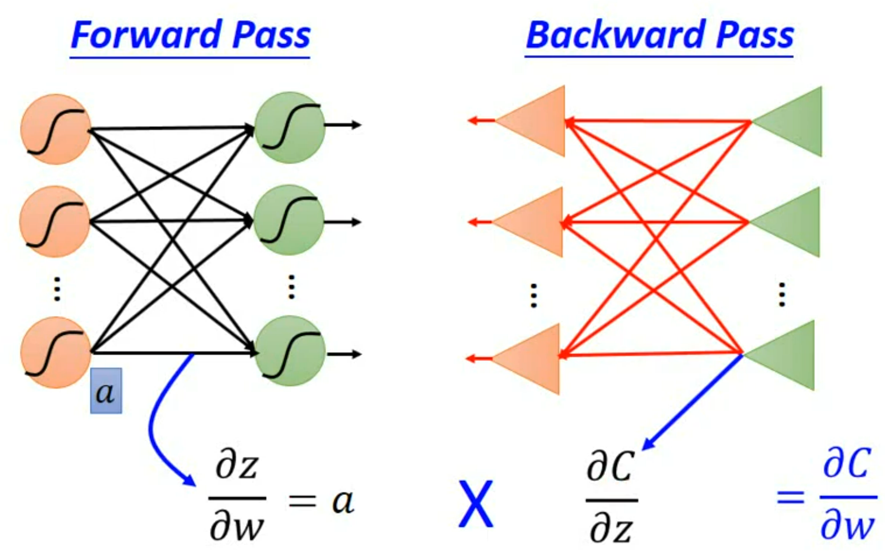

# Deep Learning
## History
 - 1958: Perceptron (linear model)
 - 1969: Perceptron has limitation
 - 1980s: Multi-layer perceptron
   - Do not have significant difference from DNN today
 - 1986: Backpropagation
   - Usually more than 3 hidden layers is not helpful
 - 1989: 1 hidden layer is "good enough", why deep?
 - 2006: RBM initialization (breakthrough)
 - 2009: GPU boost
 - 2011: Start to be popular in speech recongition
 - 2012: win ILSVRC image competition

## Recipe of Deep Learning
 - Step1: Neural Network
 - Step2: goodness of function
 - Step3: pick the best function

### Fully Connect Feedforward Network
 - **`Fully connected`**: Each neuron is connected to all neurons in the previous layer.
 - **`Feedforward`**: Each neuron is only connected to the neurons in the previous layer and outputs it to the next layer. There is no feedback between layers.

### Layer of Network

 - **`Input Layer`**: Just input, not a layer of neuron
 - **`Hidden Layers`**: Layers of neuron except last layer, feature extractor replacing feature engineering
 - **`Output Layer`**: Last layer of neuron, not output, can be seen as a multi-class classifier

### Matrix Operation

GPU can be called to finish matrix operation to boost the caculation. 

### From ML to DL
Change the problem from how to choose the feature to how to design neural network. 
 - How many layers? 
 - How many neurons for each layer?
 - Design network by machine?
 - Re-design the structure of network?

## Deeper is Better?
With a sufficient number of neurons, an inner layer can represent any function. 

### Offer a Complicate model
A complicate model can contain a large set of function. So it's more likely to find a function with small loss in that set of function. 

So a model with a large number of parameters performs better. 

### Fat + Short v.s. Thin + Tall
Yes, one hidden layer can represent any function. However, using deep structure is more effective. 

So using a thin and tall network consumes less parameters. 

Use `ReLU` as activation function to generate polyline. 

Deep network only uses $2k$ parameters to generate polyline with $2^k$ segments. Meanwhile, shadow network needs $2^k$ parameters. 

Deep networks outperforms shallow ones when the required functions are complex and regular. 

## Backpropagation
There are millions of parameters in $\theta$ vector. To compute the gradients efficiently we use backpropagation. 

### Varialbe Definition
We define a neuron network as follows:
 - **`Input`**: $\boldsymbol{x^n}$
 - **`Label`**: $\boldsymbol{\hat{y}^n}$
 - **`Parameters`**: $\boldsymbol{\theta}$
 - **`Output`**: $\boldsymbol{y^n}$
 - **`Loss`**: 
  $$
  C^n(\theta) = Loss(\boldsymbol{\hat{y}^n}, \boldsymbol{y^n}) \\
  L(\theta) = \sum_{n=1}^N C^n(\theta)
  $$

### Forward and Backward Pass
For one neuron, we have:

$$
z = x_1w_1 + x_2w_2 + b \\
\frac{\partial{C}}{\partial{w}} = \frac{\partial{z}}{\partial{w}}\frac{\partial{C}}{\partial{z}}
$$

#### Forward Pass
$$
\frac{\partial{z}}{\partial{w_1}} = x_1, \frac{\partial{z}}{\partial{w_2}} = x_2
$$

The rule is: the differential is the input multiplied by the weight. 

#### Backward Pass

$$
\left\{
\begin{aligned}
\frac{\partial{C}}{\partial{z}} &= \frac{\partial{a}}{\partial{z}}\frac{\partial{C}}{\partial{a}} \\
\frac{\partial{C}}{\partial{a}} &= \frac{\partial{z'}}{\partial{a}}\frac{\partial{C}}{\partial{z'}} + \frac{\partial{z''}}{\partial{a}}\frac{\partial{C}}{\partial{z''}} \\
&= w_3\frac{\partial{C}}{\partial{z'}} + w_4\frac{\partial{C}}{\partial{z''}}
\end{aligned}
\right. \\
\Rightarrow
\frac{\partial{C}}{\partial{z}} = \sigma'(z)\left[w_3\frac{\partial{C}}{\partial{z'}} + w_4\frac{\partial{C}}{\partial{z''}}\right]
$$

The rule is: the differential is the differential of output activation function. It can be showed as:

The the process of caculating $\frac{\partial{C}}{\partial{z}}$ on a neural network can be seen as a neural network with same $\boldsymbol{\theta}$ and activation function $\sigma'(z)$

So for the neural network, we have:

And $\sigma'(z)$ can be caculated from $\sigma(z)$:
$$
\sigma'(z) = \left(\frac{1}{1+e^{-z}}\right)' = -\frac{e^{-z}}{\left(1+e^{-z}\right)^2} = \sigma(z)\left(\sigma(z)-1\right)
$$

## Theory of Deep Learning
### Ideal Alternatives
 - Model: A function $f_h$ with threshold $h$
  $h \in \mathcal{H}$, $|\mathcal{H}|$ is the number of candidate functions (model "complexity")
 - Loss function: The average number of times the output result is correct
  $$
  L(h, \mathcal{D}) = \frac1N \sum_n l(h, x^n, \hat{y}^n) \\
  l(h, x^n, \hat{y}^n) = I(f_h(x^n) \ne \hat{y}^n)
  $$
  **Drawback**: Not differentiable! So we can't use gredient descent.
 - Find the best function: Find the best threshold $h^{all}$ over all possible dataset $\mathcal{D}_{all}$
  $$
  h^{all} = \arg \min_h L(h, \mathcal{D}_{all})
  $$

### Reality Constrain
However, we can only collect some examples $\mathcal{D}_{train}$ from $\mathcal{D}_{all}$. But we assume that $\mathcal{D}_{train}$ is **indepently and identically ditributed (i.i.d.)**

In that case, we can have:
$$
h^{train} = \arg \min_h L(h, \mathcal{D}_{train})
$$

We hope $L(h^{train}, \mathcal{D}_{all}) - L(h^{all}, \mathcal{D}_{all}) \le \delta$ are close. With a proper training set in which $\forall h \in \mathcal{H}, |L(h, \mathcal{D}_{all}) - L(h, \mathcal{D}_{all})| \le \delta/2$, we can fulfill it. That's because:
$$
L(h^{train}, \mathcal{D}_{all}) \le L(h^{train}, \mathcal{D}_{train}) +\delta/2 \le L(h^{all}, \mathcal{D}_{train}) + \delta/2 \le (L(h^{all}, \mathcal{D}_{all}) + \delta/2) + \delta/2
$$

The probility of choose a bad $\mathcal{D}_{train}$ can be estimated by:
$$
P(\mathcal{D}_{train}\ is\ bad) = \bigcup_{h \in \mathcal{H}} P(\mathcal{D}_{train}\ is\ bad\ on\ h) \le \sum_{h \in \mathcal{H}} P(\mathcal{D}_{train}\ is\ bad\ on\ h)
$$

According to **Hoeffding's Inequality** $P(\mathcal{D}_{train}\ is\ bad\ on\ h) \le 2\exp(-2N\varepsilon^2), \varepsilon = \delta/2$ we can get:
$$
P(\mathcal{D}_{train}\ is\ bad) \le \sum_{h \in \mathcal{H}} 2\exp(-2N\varepsilon^2) = 2|\mathcal{H}|\exp(-2N\varepsilon^2)
$$

So we can get better training dataset by increase $N$ and decrease $\mathcal{H}$. However, we will encounter difficulties when doing these.
 - Increase $N$: Costy
 - Decrease $\mathcal{H}$: Increase $L(h^{all}, \mathcal{D}_{all})$

When output of training function is continual, we can use **VC-dimension** to measure the possiblity.