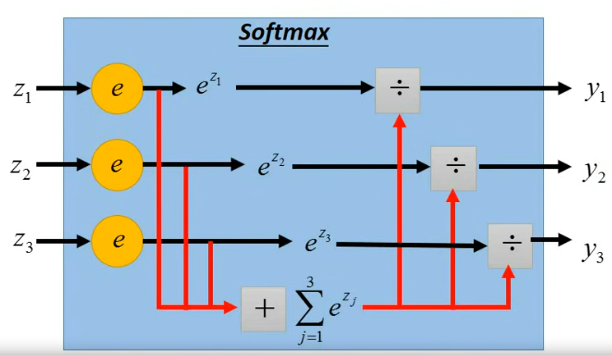
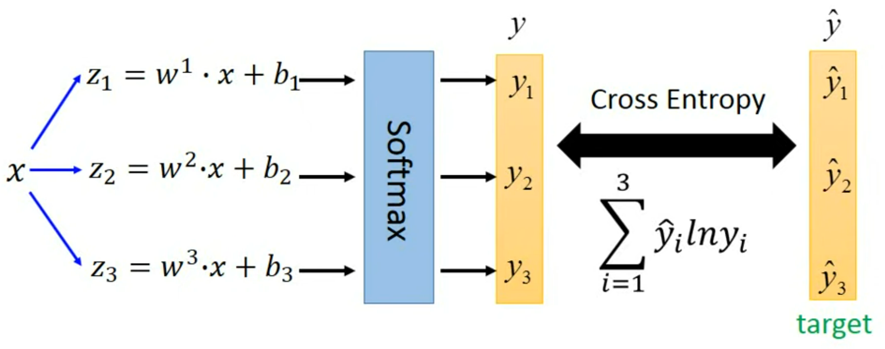

# Classification
## Classification as Regression
### Implementation
Binary classification as example
 - Output a scalar between -1 and 1
   - closer to 1 $\rightarrow$ class 1
   - closer to -1 $\rightarrow$ class 2

### Drawback
 - Penalize to the exmaples that are "too correct"
 - Mutiple classification may encounter a problem. There may be no relationship between two classes. 

### Ideal Alternatives
 - Model: Input features and output class. 
 - Loss function: The number of times the output result is correct
  $$
  L(f) = \sum_n \delta(f(x^n) \ne \hat{y}^n)
  $$
  **Drawback**: Not differentiable!
 - Find the best function: Perceptron, SVM

## Probalitity Generative Model
 - Step1: Guess Distribution (Function Set)
 - Step2: Calulate Likelihood (Goodness of a function)
 - Step3: Maximize Likelihood (Find the best function)
### Posterior Probability
$$
P(C_1|x) = \frac{P(x|C_1)P(C_1)}{P(x|C_1)P(C_1) + P(x|C_2)P(C_2)}
$$

### Gaussian Distribution
$$
f_{\mu, \Sigma}(x) = \frac{1}{(2\pi)^{D/2}}\frac{1}{|\Sigma|^{1/2}}\exp{\left\{-\frac{1}{2}(x-\mu)^T\Sigma^{-1}(x-\mu)\right\}}
$$

**Other distribution**: Bernouli Distribution

### Maximum Likelihood
Maximize the possiblity of gaussian distribution samples the objects
$$
\mu^*, \Sigma^* = arg \max_{\mu, \Sigma} L(\mu, \Sigma),\ where\ L(\mu, \Sigma) = \prod_{i=1}^Nf_{\mu, \Sigma}(x^i)\\
\mu^* = \frac{1}{N}\sum_{i=1}^Nx^i, \Sigma^* = \frac{1}{N}\sum_{i=1}^N(x^i-\mu^*)(x^i-\mu^*)^T
$$

### Shared $\Sigma$
Each category uses different $\Sigma$, resulting in too many parameters and overfitting. Share the same $\Sigma$ in different categories can reduce model parameters and alleviate overfitting. 
$$
\Sigma = \frac{N_1}{N_1 + N_2}\Sigma^1 + \frac{N_2}{N_1 + N_2}\Sigma^2
$$

The boundary is linear, also called linear model

### Naive Bayes Classifier
All the dimemsions are independent
$$
P(\boldsymbol{x}|C) = \prod_{i=1}^N P(x_i|C)
$$

## Sigmoid Function
$$
\begin{aligned}
P(C_1|x) &= \frac{P(x|C_1)P(C_1)}{P(x|C_1)P(C_1) + P(x|C_2)P(C_2)} \\
&= \frac{1}{1 + \frac{P(x|C_2)P(C_2)}{P(x|C_1)P(C_1)}} \\
&= \frac{1}{1 + \exp{(-z)}}
\end{aligned} \\
where\ z = \ln\frac{P(x|C_2)P(C_2)}{P(x|C_1)P(C_1)}
$$

For `z` we have: 
$$
\begin{aligned}
z &= \ln\frac{P(x|C_2)P(C_2)}{P(x|C_1)P(C_1)} \\
&= \ln\frac{P(x|C_2)}{P(x|C_1)} + \ln\frac{P(C_2)}{P(C_1)} \\
&\overset{Shared\ \Sigma}{=} -\frac{1}{2}(x-\mu^1)^T\Sigma^{-1}(x-\mu^1) + \frac{1}{2}(x-\mu^2)^T\Sigma^{-1}(x-\mu^2) + \ln\frac{N_1}{N_2} \\
&= \left((\mu^1-\mu^2)^T\Sigma^{-1}\right)x + \left( - \frac12(\mu^1)^T(\Sigma)\mu^1 + \frac12(\mu^2)^T(\Sigma)\mu^2 + \ln\frac{N_1}{N_2}\right) \\
&= \boldsymbol{w}^T \boldsymbol{x} + b
\end{aligned}
$$

Then we can get $P(C|x) = \frac{1}{1 + e^{-(b+\boldsymbol{w}^T \boldsymbol{x})}} = sigmoid(b+\boldsymbol{w}^T \boldsymbol{x})$

## Discriminative v.s Generative
 - Discriminative Model: $P(C_1|x) = sigmoid(b+\boldsymbol{w}^T \boldsymbol{x})$
   - Make many assumption(gaussian distribution, naive bayes classifier)
   - Perform better on small training data
   - More robust to the noise
   - Priors and class-dependent probabilities can be estimated from different sources
 - Generative Model: $P(C_1|x) = \frac{P(x|C_1)P(C_1)}{P(x|C_1)P(C_1) + P(x|C_2)P(C_2)}$
   - Make no assumption
   - Depend on dataset

## Multi-class Classification
Put a layer between feature extractor and output which is called **Softmax**. The function can be written as:
$$
y_n = \frac{e^{z_n}}{\sum_{n}e^{z_n}}
$$

### Conditional Entropy
According to Bayes' rule of possiblity: 
$$
P(X, Y) = P(X)P(Y|X)
$$

Then $H(Y|X)$ can be seen as the amount of information needed from $(X)$ state to $(X, Y)$. So it can be caculated by:
$$
\begin{aligned}
H(Y|X) &= H(X, Y) - H(X) \\
&= \sum_{x, y}-p(x, y)\log_2 p(x, y) + \sum_{x}p(x)\log_2 p(x) \\
&= -\sum_{x, y}p(x, y)\log_2\frac{p(x, y)}{p(x)}
\end{aligned}
$$

### Maximum Entropy Principle
Let the feature vector be $X$ and the output vector be $Y$ then softmax function is a prossbility distribution of $P(Y|X)$

We want this possibility distribution function has following properties:
 - The same expectation of probability distribution on the data set
 - Maximize the entropy

Then it's a conditional extreme value problem, we can solve it by **Lagrange multiplier**
 - **`Objective function`**:
   - $H(Y|X) = -\sum_{x, y}p(x, y)\log_2\frac{p(x, y)}{p(x)}$
 - **`Condition function`**:
   - $E_P(f(X)) = E_{\hat{P}}(f(X))$
   - $\sum_yp(y|x) = 1$

Largrange function can be written as:
$$
\begin{aligned}
L(P, \lambda) &= \sum_{x, y}p(x, y)\log_2\frac{p(x, y)}{p(x)} + \lambda_0\left(1 - \sum_yp(y|x) \right) + \lambda \cdot\left(E_{\hat{P}}(f(X)) - E_P(f(X))\right) \\
&= \sum_{x, y}p(x)p(y|x)\log_2p(y|x) + \lambda_0\left(1 - \sum_yp(y|x) \right) + \lambda \cdot\left(E_{\hat{P}}(f(X)) - \sum_{x, y}p(x)p(y|x)f(x, y)\right) \\
&= \sum_{x, y}\hat{p}(x)p(y|x)\log_2p(y|x) + \lambda_0\left(1 - \sum_yp(y|x) \right) + \lambda \cdot\left(E_{\hat{P}}(f(X)) - \sum_{x, y}\hat{p}(x)p(y|x)f(x, y)\right)
\end{aligned} \\
$$

Then computate the derivative of $L(P, \lambda)$, we can get:
$$
\begin{aligned}
\frac{\partial{L(P, \lambda)}}{\partial{p(y|x)}} &= \sum_{x, y}\hat{p}(x)(\log_2p(y|x) + 1) - \sum_y\lambda_0 - \sum_{x, y}\lambda \cdot f(x, y) \\
&= \sum_{x, y}\hat{p}(x)\left((\log_2p(y|x) + 1) - \lambda_0 - \lambda \cdot f(x, y)\right) \\
&\equiv 0 \\
\end{aligned} \\
\Rightarrow \log_2 p(y|x) + 1 - \lambda_0 - \lambda \cdot f(x, y) = 0
$$

So that, we can get that:
$$
p(y|x) = 2^{\lambda_0-1 + \lambda \cdot f(x, y)}
$$

For convience, we change the base into $e$:
$$
p(y|x) = e^{\lambda_0-1 + \lambda \cdot f(x, y)}
$$

With condition $\sum_yp(y|x) = 1$, we can get:
$$
\sum_y p(y|x) = 1 \Rightarrow e^{1-\lambda_0} = \sum_y e^{\lambda\cdot f(x, y)} \\
p(y|x) = \frac{e^{\lambda\cdot f(x, y)}}{\sum_y e^{\lambda\cdot f(x, y)}} = \frac{e^{z}}{\sum_{y}e^{z}}, where\ z = \lambda\cdot f(x, y)
$$

### Softmax Function and Sigmoid Function
The equation can be represented graphically as follows: 

If fact, **Sigmoid Function** is a certain form of **Softmax Function**. That's because:
$$
sigmoid(z) = \frac{1}{1 + e^{-z}} = \frac{e^z}{e^0 + e^z}
$$

### Loss Function
We caculate the corss entropy of $y$ and $\hat{y}$ to get the loss function:

Then it can be written as:
$$
L(\hat{y}, y) = -\sum_{i}\hat{y_i}\ln y_i,\ y_i = \frac{e^{z_i}}{\sum_{j}e^{z_j}}
$$

### Gradient Descent
The derivative of loss function can be written as:
$$
\begin{aligned}
\frac{\partial{L(\hat{y}, y)}}{\partial{z_j}} &= \sum_{i}\frac{\partial{L(\hat{y}, y)}}{\partial{y_i}}\frac{\partial{y_i}}{\partial{z_j}} \\
&= -\sum_{i}\hat{y_i}\frac{\partial{\ln y_i}}{\partial{y_i}}\frac{\partial{y_i}}{\partial{z_j}} \\
&= -\sum_{i}\frac{\hat{y_i}}{y_i}\frac{\partial{y_i}}{\partial{z_j}}
\end{aligned}
$$

For partial of $y_i$:
$$
\frac{\partial{y_i}}{\partial{z_j}} = 
\left\{
\begin{aligned}
& y_i(1-y_i),\ i = j \\
& -y_iy_j,\ i \neq j
\end{aligned}
\right.
$$

Then the partial of $L$:
$$
\frac{\partial{L(\hat{y}, y)}}{\partial{z_j}} = \sum_{i}\hat{y_i}y_j - \hat{y_j} = y_j - \hat{y_j} \\ 
\nabla L = y - \hat{y}
$$
