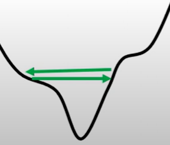

# Network Design
## Recipe of Model Design
Train model in more complicate way(deepen the network, more iteration and so on) and measure the loss.
```txt
loss on training data
├─ large
│  ├─ model bias: make your model complex
│  └─ optimizatoin issue
└─small: loss on testing data
   ├─ large: 
   |  ├─ overfitting
   |  └─ mismatch
   └─ small: good job!
```

### Distinguish Model Bias and Optimizatoin Issue
Gaining the insights from the loss on training data.
 - Model Bias: Deepen the network reduce the loss on training data
 - Optimization Issue: Deepen the network doesn't work

So start with shadower model to choose the optimizaton issue. 

### Dealing with Overfitting
 - More training data
 - Data augmentation
   - construct new data from the origin data
 - Make your model simpler
   - less parameters
   - share parameters
 - Less features
 - Early stopping
 - Regularization
 - Dropout
   - a method to restrain the model

Most of methods mentioned above is introduced in 03ModelDesign except Dropout

### Mismatch
Training data and testing data have different distributions. 
Simply increasing the training data will not help. 

## Optimization Issue
### Critical Point
The point whose gradient is close to zero.
 - Local minima: No way to go
 - Saddle point: Can escape

**Distinguish Critical Point**
With Taylor Expansion we can have:
$$
L(\boldsymbol{\theta}) \approx L(\boldsymbol{\theta_0}) + (\boldsymbol{\theta} - \boldsymbol{\theta_0})^T g + \frac{1}{2}(\boldsymbol{\theta} - \boldsymbol{\theta_0})^TH(\boldsymbol{\theta} - \boldsymbol{\theta_0})
$$

At critial point $g = 0$:
$$
L(\boldsymbol{\theta}) \approx L(\boldsymbol{\theta_0}) + \frac{1}{2}(\boldsymbol{\theta} - \boldsymbol{\theta_0})^TH(\boldsymbol{\theta} - \boldsymbol{\theta_0}) = L(\boldsymbol{\theta_0}) + \frac{1}{2}\boldsymbol{v}^T H\boldsymbol{v}
$$

 - Local minima: $\forall \boldsymbol{v}, \boldsymbol{v}^T H\boldsymbol{v} > 0$
 - Local maxima: $\forall \boldsymbol{v}, \boldsymbol{v}^T H\boldsymbol{v} < 0$
 - Saddle point: $\exist \boldsymbol{v_1}, \boldsymbol{v_2}, \boldsymbol{v_1}^T H\boldsymbol{v_1} < 0, \boldsymbol{v_2}^T H\boldsymbol{v_2} < 0$

Then when at saddle point, we can escape saddle point at the direction of $\boldsymbol{v_2}$

In partical training, the error surface may have millions of dimension, we usually stop at a saddle point rather than local mimima. 

### Batch 
 - Batch: Dataset is divided into batches, after training on a batch we should update the parameters. 
 - Epoch: A training on the whole dataset, we may update batch after see all the data. 
 - Shuffle: Update batch after an epoch. 

#### Small Batch v.s. Large Batch
Larger batch size does not require longer time to compute gradient (unless batch size is too large)

Because GPU can boost training by parallel computing, only batch size larger than GPU fan-in size computation costs more time. 

So smaller batch requires longer time for one epoch (longer time for seeing all data once)


Small batch size causes "noisy" update. However, small batch size has better performance over large one. 


More "noisy" the update is, more possible the minima can be escaped.

The minima can be classified into "flat" one and "sharp" one. When close to "flat" minima, the difference between testing loss and training loss is small which is seen as a good properity. 


### Momentum 
Movement not just based on gradient, but previous movement. This idea learns from the concept of momentum in physics. May help to escape local minima. 


### Adaptive Learning Rate
In fact, training can be difficult even without critical points.

A fixed learnig rate may cause parameters viberate in a rugged error surface without reducing loss.


As gridents on different dimensions are different, a shared learning rate may cause "pace" is too large for some dimensions and too small for others. 


The update can be written as:
$$
\theta_i^{t+1} \leftarrow \theta_i^t - \frac{\eta^t}{\delta_i^t}g_i^t
$$

To get a better update function is to get a better form of $\delta_i^t$ and $\eta^t$.

A better form of $\delta_i^t$:
 - RMSProp
  Consider the recent gradient has larger influnce, and the past gradients have less influence.
  $$
  \theta_i^{t+1} \leftarrow \theta_i^t - \frac{\eta^t}{\delta_i^t}g_i^t \\
  \delta^t = \sqrt{\alpha(\delta^{t-1})^2+(1-\alpha)(g^t)^2}
  $$
A better form of $\eta^t$
 - Learning Rate Decay
  As the training goes, we are closer to the destination, so we reduce the learning rate. 
 - Warm Up
  Increase and then decrease the learning rate. 
  At the beginning, the estimate of $\sigma_i^t$ has large variance. 
 - Annealing
 - Fine-tuning
 
**Some methods are mentioned in 02Regression ()**
 - Adaptive Learning Rate
 - Adaptive Gradient Descent(Adagrad)
 - Second Derivative(mult-parameters)
 - Stochastic Gradient Descent(SGD)
 
### Momentum and Adaptive Learning Rate
Consider momentum and adaptive learning rate, the update function can be written as:
$$
\theta_i^{t+1} \leftarrow \theta_i^t - \frac{\eta^t}{\delta_i^t}m_i^t
$$

Momentum and adaptive learning rate consider the influence of previous gradients in different way:
 - Momentum: Consider direction, weighted sum of the previous gradients
 - Adaptive learning rate: Only magnitude, root mean square of the gradients

### Optimization for Deep Learning
#### On-line v.s. Off-line
 - On-line: one pair of $(x_t, \hat{y}_t)$ at a time step
 - Off-line: pour all $(x_t, \hat{y}_t)$ into the model at every time step

#### SGD with Momentum (SGDM)
$$
\theta_i^{t+1} = \theta_i^{t} - \eta m_i^t \\
m_{t+1} = \beta m_t + (1-\beta)g_t
$$

If $g_0 = 0$, the parameters also are stuck on the origin state. 

#### Adam
A combination of RMSProp and Momentum.
$$
\theta_i^{t+1} = \theta_i^{t} - \frac{\eta}{\sqrt{\hat{\delta}^t_i} + \varepsilon} \hat{m}_i^t \\
\hat{\delta}^t_i = \frac{\delta^t_i}{1-\alpha^t}\\
\hat{m}_i^t = \frac{m^t_i}{1-\beta^t}
$$

The adaptation of $\delta^t_i, m^t_i$ is called **de-biasing** to avoid be stuck at initial point. The constants are always set to $\varepsilon = 10^{-8}, \alpha = 0.999, \beta = 0.9$

#### Adam v.s. SGDM
Currently commonly used are Adam and SGDM.
 - Adam: fast training, large generalization gap, unstable
 - SGDM: stable, little generalization gap, better convergence

#### SWATS
Try to combine Adam with SGDM. In fact, you use Adam firstly and SGDM later, but you need to solve how to initalize $\eta_{SGDM}$ when switching. 

#### Towards Improving Adam ...
 - Trouble shooting
  Maximum movement distance for one single update is roughly upper bounded by $\sqrt{\frac1{1-\alpha}}\eta$
  Non-informative gradients contribute more than imformative gradients. 
 - AMSGrad
  $$
  \theta_i^{t+1} = \theta_i^{t} - \frac{\eta}{\sqrt{\hat{\delta}^t_i} + \varepsilon} m_i^t \\
  \hat{\delta}^t_i = \max(\hat{v}_{t-1}, v_t)\\
  $$
 - Trouble shooting
 Learning rates are either extremely large (for small gradients) or extremely small (for large gradients).
 - AdaBound
  $$
  \theta_i^{t+1} = \theta_i^{t} - Clip\left(\frac{\eta}{\sqrt{\hat{\delta}^t_i}}\right) m_i^t \\
  Clip(x) = Clip\left(x, 0.1-\frac{0.1}{(1-\alpha)t + 1}, 0.1+\frac{0.1}{(1-\alpha)t}\right)
  $$

#### Towards Improving SGDM ...
 - Trouble shooting
  Can't dynamically adjust learning rate over time. Too slow for small learning rates and bad results for large learning rates. 
 - LR range test
  Meausre the error in output as a function of increasing learing rate. 
 - Cyclical LR
  Change the learning rate periodically in the form of sawtooth waves. Decide max_lr and base_lr by LR range test. 
  
 - SGDR
  Change the learning rate periodically. Increase to max_lr and decrease in the form of sine waves. 
  
 - One-cycle LR
  Change the learning rate in three steps: warm-up + annealing + fine-tuning.
  

#### Warm-up for Adam
Experiments show that the gradient distribution distorted in the first 10 steps. Then Adam needs warm-up. 

 - RAdm: Adjust $\eta$ with $r_t$ to warm-up
  $$
  \rho_t = \rho_{\infty}-\frac{2t\alpha^t}{1-\alpha^t} \\
  \rho_{\infty} = \frac{2}{1-\alpha}-1 \\
  r_t = \sqrt{\frac{(\rho_t-4)(\rho_t-2)}{(\rho_{\infty}-4)(\rho_{\infty}-2)\rho_t}} \\
  \theta^{t+1}_i = 
  \left\{\begin{aligned}
  \theta^t_i - \eta \hat{m}_i^t, \rho_t \le 4 \\
  \theta^t_i - \frac{r_t\eta}{\sqrt{\hat{v}_i^t}+\varepsilon} \hat{m}_i^t, \rho_t > 4
  \end{aligned}\right.
  $$

#### Lookahead
`k` step forward, `1` step back. Universal wrapper for all optimizers.  
$$
\begin{aligned}
&for\ each\ t\ (outer\ loop): \\
&\qquad \theta_{t, 0} = \phi_{t-1} \\
&\qquad for\ each\ i\ (inner\ loop): \\
&\qquad\qquad \theta_{t, i} \theta_{t, i-1}+Optim(Loss, data, \theta_{t, i-1}) \\
&\qquad \phi_t = \phi_{t-1} +\alpha(\theta_{t, k}-\phi_{t-1})
\end{aligned}
$$

More stable, better generalization. 

#### Toward Improving Momentum ...
Update momentum by looking into the future. 
 - Nesterov Accelerated Gradient (NAG)
  $$
  \theta^{t+1} = \theta^t - m^{t+1}\\
  m^{t+1} = \lambda m^t + \eta \nabla L(\theta^t-\lambda m^t)
  $$

  To avoid caculate both $\nabla L(\theta^t)$:
  $$
  \begin{aligned}
  \theta^{t+1} - \lambda m^{t+1} &= (\theta^t- m^{t+1}) - \lambda m^{t+1} \\
  &= \theta^t-(\lambda m^t+\eta \nabla L(\theta^t-\lambda m^t))-\lambda m^{t+1} \\
  &= (\theta^t - \lambda m^t) - \lambda m^{t+1} - \eta \nabla L(\theta^t-\lambda m^t)
  \end{aligned}
  $$

  Then we can write update function as:
  $$
  \theta^{t+1} = \theta^t-\lambda m^{t+1} - \eta \nabla L(\theta^t)
  $$

 - Nadam
  Use NAG in Adam:
  $$
  \theta_i^{t+1} = \theta_i^{t} - \frac{\eta}{\sqrt{\hat{\delta}^t_i} + \varepsilon} \hat{m}_i^t \\
  \hat{m}_i^t = \frac{\beta m^t_i}{1-\beta^t} + \frac{(1-\beta) g^t_i}{1-\beta^t}
  $$

#### Import Regurization into Optimizer?
Regurizatoin import a penalty into loss function:
$$
L_{l_2}(\theta) = L(\theta) + \frac12 \gamma ||\theta||^2 \\
\nabla L_{l_2}(\theta) = \nabla L(\theta) + \gamma \theta
$$

We only introduce regurization into update $\theta^t$ and use $L(\theta)$ when update $m^t, \delta^t$. That's called **SGDWM** and **AdamW**
 - SGDWM
  $$
  \theta_i^{t+1} = \theta_i^{t} - \eta m_i^t - \gamma \theta^t_i\\
  m_{t+1} = \beta m_t + (1-\beta)g_t
  $$
 - AdamW
  $$
  \theta_i^{t+1} = \theta_i^{t} - \eta\left(\frac{1}{\sqrt{\hat{\delta}^t_i} + \varepsilon} \hat{m}_i^t-\eta \theta^t_i\right) \\
  \hat{\delta}^t_i = \frac{\delta^t_i}{1-\alpha^t}\\
  \hat{m}_i^t = \frac{m^t_i}{1-\beta^t}
  $$

#### Some Other Tips
 - Shuffling
 - Dropout
 - Gradient noise
  $$
  \hat{g}_{t, i} = g_{t, i} + N(0, \sigma_t^2), \sigma = \frac{c}{(1+t)^\gamma}
  $$
 - Warm-up
 - Curriculum learning
  Train your model with easy data first, then difficult data. 
 - Fine-tuning
 - Normalization
 - Regularization

#### Advices
 - SGDM
   - Computer vision
    image classification, segmentation, object detection
 - Adam
   - NLP
    QA, machine translation, summary
   - Speech synthesis
   - GAN
   - Reinforcement learning