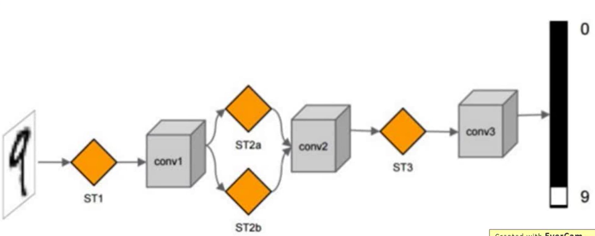
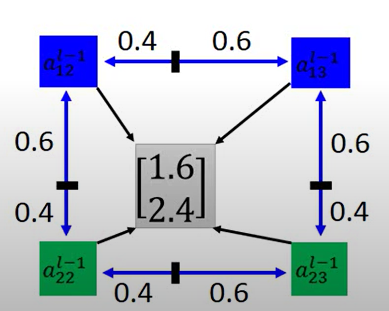

# Convolutional Neural Network
## Image  Recongnization
### Fully Connected Feedforward Neural Network
 - Fully connected means that each neuron is connected to all neurons in the previous layer.
 - Feedforward Neural Network (FNN, Feedforward Neural Network) refers to the hierarchical arrangement of neurons. Each neuron is only connected to the neurons of the previous layer, receives the output of the previous layer, and outputs it to the next layer. There is no feedback.
 - Requires a lot of parameters. 
 - Each neuron is a classifier, which is unnecessary.

According to human intuitive understanding, we do not process images like a fully connected neural network. Specifically, what are the aspects?

### Receptive Field
Some patterns are much smaller than the whole image. So we should be able to identify these patterns with a small number of parameters. 

These small part of image connected to nerual is called **Receptive Field**.

#### Padding
When processing pixels at the edge of an image, the sampling range may exceed the image. Therefore, a circle of blank space needs to be added around the image to prevent sampling out of the picture This circle of blank space is called **padding**. 

#### Stride
The distance that the receptive fields moves each time is called **stride**. 

To recongize every pattern on the picture, we want receptive fields overlap each other as much as possilbe. 

### Share Parameters
The same patterns appear in different regions.

Therefore, multiple classifiers (or detectors) that recognize the same pattern in different areas should use the same set of parameters or shared parameters.

### Convolutional Layer

 - Some partterns are much smaller than the whole image
 - The same patterns appear in different regions

### Feature Map
The receptive field processed by the filter will get a value, which can be regarded as a "pixel", and the entire image processed by the same filter can get a new "picture" which is called **Feature Map**. 

Filters of the first layer can only recongize $3\times 3$ pixels and filters of the second layer can recongize $5\times 5$ pixels. So with the number of layer gets larger, filters can recongize larger field. 

### Max Pooling
Subsampling the pixels will not change the object. 

Reducing/downsampling the image does not affect our understanding of the image. So we can process the image with fewer parameters by subsampling the pixels to make image smaller. 

Max pooling is a kind of downsampling (Subsample). Subsampling does not necessarily have to take the maximum value, but can also take the average. 

### Application: Playing Go
The whole process of CNN can be summerized as follows:

However, in practical applications, we need to make some designs based on the characteristics of the data. For example, in training a network to playing go we may suppose:
 - Some patterns are much smaller than the whole image
  Alpha Go uses $5 \times 5$ for first layer
 - The same patterns appear in different regions
 - Subsampling the pixels will not change the object
  Alpha Go does not use neither Pooling nor Padding

### Drawback
CNN is not invariant to scaling and rotation (we need data augmentation). 

### Spatial Transformer Layer
The layer used to perform basic graphics operations on images (such as traslation, rotation, scaling) which is called ST layer. 

 - End-to-end learn: Divide learning process into different modules and link these modules into a pipeline. We can use multiple ST layers to get better performance. 

#### Transformation Matrix
$$
\begin{bmatrix}
  x' \\ y'
\end{bmatrix} = 
\begin{bmatrix}
  a &b \\
  c &d \\
\end{bmatrix}
\begin{bmatrix}
  x \\ y
\end{bmatrix} + 
\begin{bmatrix}
  e \\ f
\end{bmatrix}
$$

 - Translation
  $$
  \begin{bmatrix}
    x' \\ y'
  \end{bmatrix} = 
  \begin{bmatrix}
    1 &0 \\
    0 &1 \\
  \end{bmatrix}
  \begin{bmatrix}
    x \\ y
  \end{bmatrix} + 
  \begin{bmatrix}
    e \\ f
  \end{bmatrix}
  $$
 - Rotation
  $$
  \begin{bmatrix}
    x' \\ y'
  \end{bmatrix} = 
  \begin{bmatrix}
    cos\theta &-sin\theta \\
    sin\theta &cos\theta \\
  \end{bmatrix}
  \begin{bmatrix}
    x \\ y
  \end{bmatrix}
  $$
 - Scaling
  $$
  \begin{bmatrix}
    x' \\ y'
  \end{bmatrix} = 
  \begin{bmatrix}
    a &0 \\
    0 &d \\
  \end{bmatrix}
  \begin{bmatrix}
    x \\ y
  \end{bmatrix}
  $$

#### Interpolation

Convert discrete functions into continuous functions by applying the gradient descent method